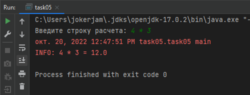
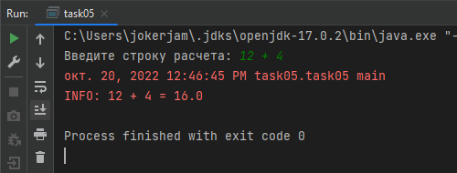

# Почему вы не можете не использовать API

## Задача 1
Дана строка sql-запроса "select * from students where ". <br>
Сформируйте часть WHERE этого запроса, используя StringBuilder. Данные для фильтрации приведены ниже в виде json строки.<br>
Если значение null, то параметр не должен попадать в запрос.

**Параметры для фильтрации:**

`{"name":"Ivanov", "country":"Russia", "city":"Moscow", "age":"null"}`


## Задача 2


```json
[
    {"фамилия":"Иванов","оценка":"5","предмет":"Математика"},
    {"фамилия":"Петрова","оценка":"4","предмет":"Информатика"},
    {"фамилия":"Краснов","оценка":"5","предмет":"Физика"}
]
```

Написать метод(ы), который распарсит json и, используя StringBuilder, создаст строки вида: <br>
Студент [фамилия] получил [оценка] по предмету [предмет].

**Пример вывода:**

Студент Иванов получил 5 по предмету Математика.<br>
Студент Петрова получил 4 по предмету Информатика.<br>
Студент Краснов получил 5 по предмету Физика.

## Задача 3

Реализуйте алгоритм сортировки пузырьком числового массива, результат после каждой итерации запишите в лог-файл.

## Задача 4

Напишите метод, который определит тип (расширение) файлов из текущей папки и выведет в консоль результат вида

1. Расширение файла: txt
2. Расширение файла: pdf
3. Расширение файла:
4. Расширение файла: jpg

## Задача 5

К калькулятору из предыдущего дз добавить логирование.

Скриншоты:




---